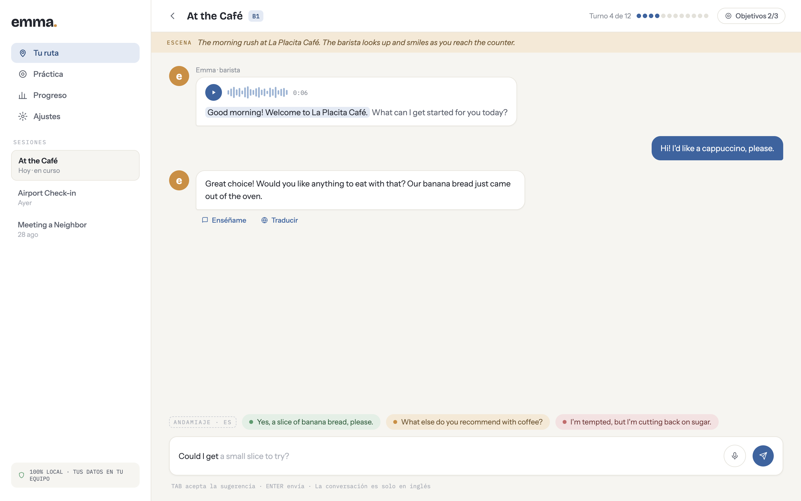
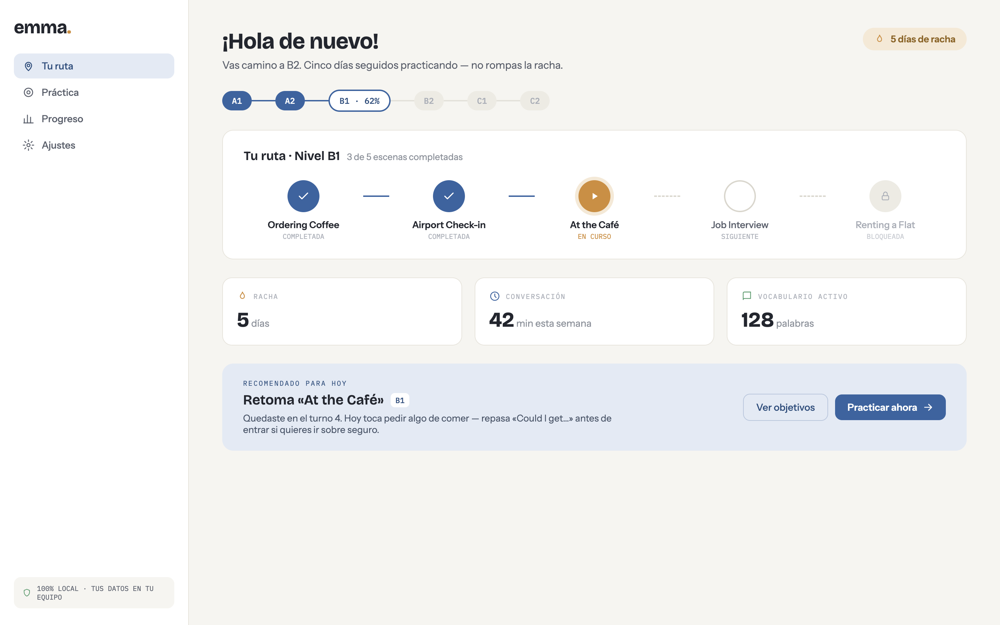
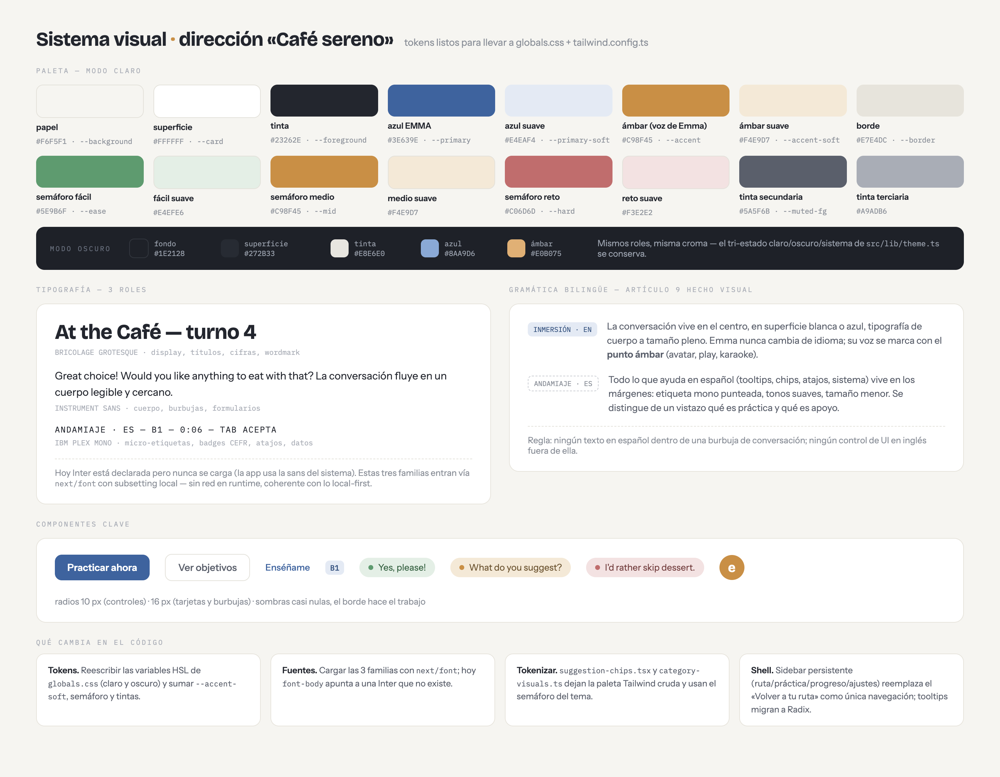
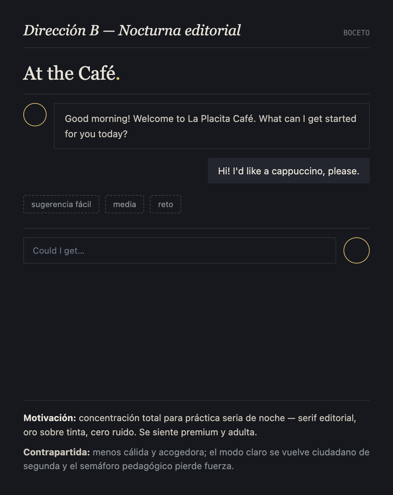
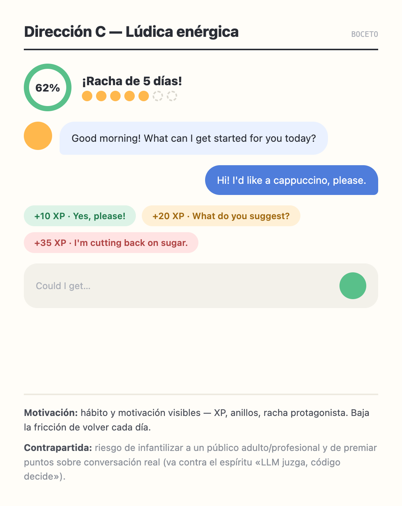

# Rediseño visual «Café sereno»

Propuesta aprobada (2026-09-01) para la nueva capa visual de EMMA Desktop.
Milestone: **v0.4.0 — Rediseño visual «Café sereno»**.

## Dirección

- **Papel cálido neutro** de fondo; superficies blancas con borde, sombras casi nulas.
- **Azul heredado enriquecido** (`#3E639E`) como primario; **punto ámbar** (`#C98F45`)
  como firma de la voz de Emma: wordmark `emma.`, avatar, reproductor, karaoke.
- **Gramática bilingüe** (Artículo 9 hecho visual): la conversación en inglés vive al
  centro a tamaño pleno; el andamiaje en español vive en los márgenes con etiqueta
  mono punteada (`ANDAMIAJE · ES`), tonos suaves y tamaño menor.
- **Tipografías** (hoy Inter está declarada pero nunca se carga): Bricolage Grotesque
  (display), Instrument Sans (cuerpo), IBM Plex Mono (micro-etiquetas), vía `next/font`.
- Radios 10 px (controles) y 16 px (tarjetas/burbujas).

## Tokens

| Rol | Claro | Oscuro |
|---|---|---|
| Fondo (papel) | `#F6F5F1` | `#1E2128` |
| Superficie | `#FFFFFF` | `#272B33` |
| Tinta | `#23262E` | `#E8E6E0` |
| Primario (azul EMMA) | `#3E639E` | `#8AA9D6` |
| Azul suave | `#E4EAF4` | — |
| Acento (ámbar, voz de Emma) | `#C98F45` | `#E0B075` |
| Ámbar suave | `#F4E9D7` | — |
| Borde | `#E7E4DC` | `#33373F` |
| Semáforo fácil / medio / reto | `#5E9B6F` / `#C98F45` / `#C06D6D` | mismos roles |

Los tonos suaves del semáforo: `#E4EFE6` / `#F4E9D7` / `#F3E2E2`.

## Pantallas

### Chat · práctica

### Home · tu ruta

### Sistema visual

## Direcciones alternativas evaluadas (descartadas)

| Boceto | Motivación | Por qué se descartó |
|---|---|---|
|  | Nocturna editorial: concentración, premium | Menos cálida; el modo claro quedaba de segunda |
|  | Lúdica: hábito y motivación visibles | Riesgo de infantilizar a un público adulto |
